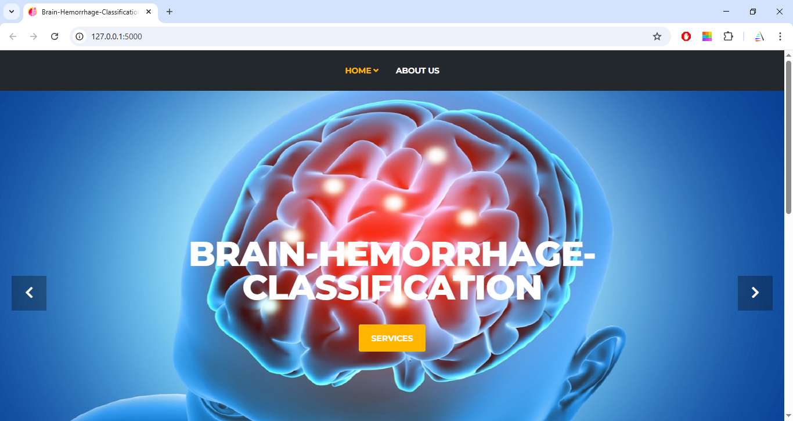
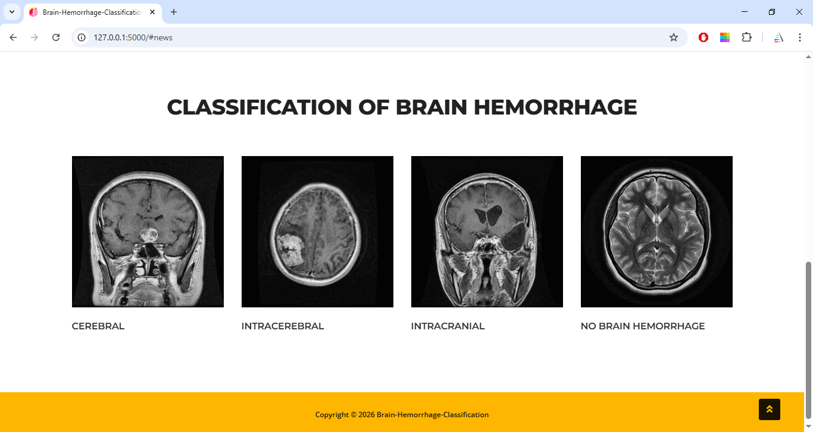
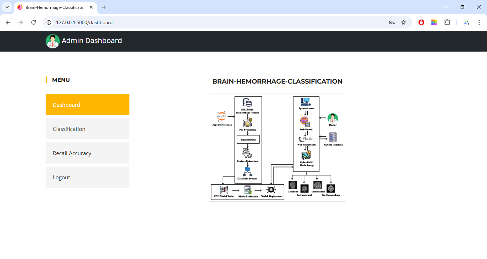
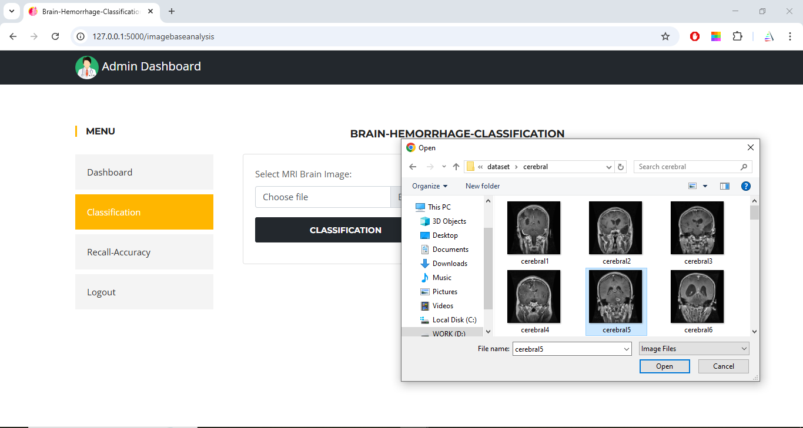
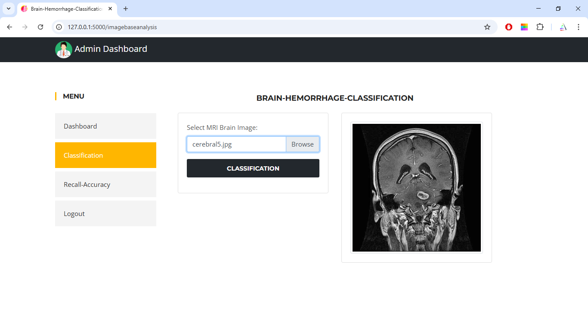
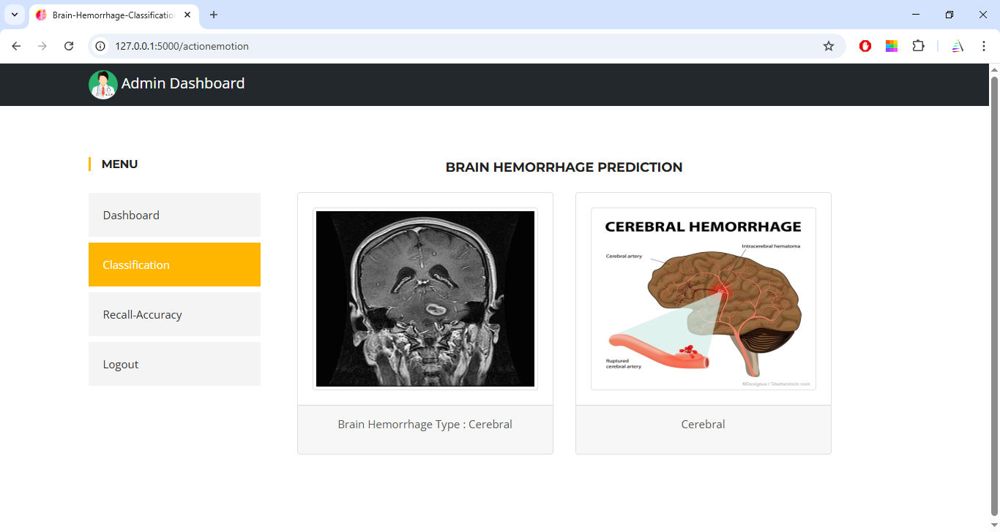
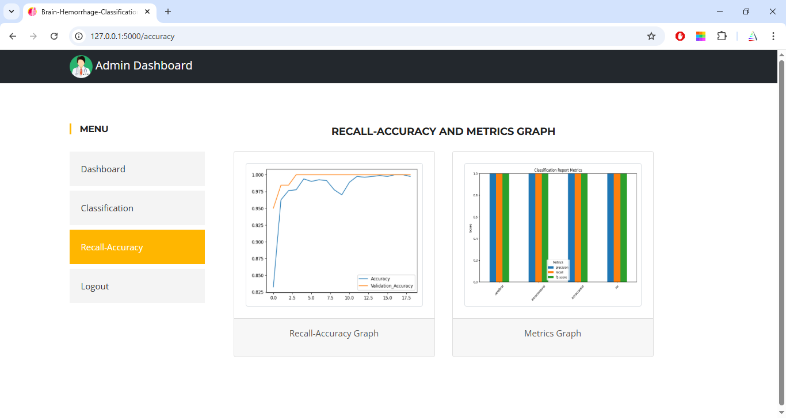

# Brain Hemorrhage Classification using Deep Learning

##  Project Overview

This project is a web-based application developed using **Python, Flask, and Deep Learning** to classify brain hemorrhage from medical images. The system allows users to upload a brain scan image and predicts the type of brain hemorrhage.

This project was developed as part of my **Master of Computer Applications (MCA)** final year project.

---

##  Features

- Upload brain scan images
- Predict brain hemorrhage type
- User-friendly web interface
- Flask-based web application
- Deep Learning model for image classification

---

##  Technologies Used

- Python
- Flask
- HTML
- CSS
- JavaScript
- TensorFlow / Keras
- NumPy
- OpenCV

---

##  Project Structure

```
Brain-Hemorrhage-Classification/
│
├── app.py
├── brainhemorrhage.db
├── static/
├── templates/
├── .gitignore
└── README.md
```

---

##  How to Run the Project

1. Clone the repository

```bash
git clone https://github.com/Navshiya04/Brain-Hemorrhage-Classification.git
```

2. Open the project folder

```bash
cd Brain-Hemorrhage-Classification
```

3. Install the required libraries

```bash
pip install -r requirements.txt
```

4. Run the application

```bash
python app.py
```

5. Open your browser and visit

```
http://127.0.0.1:5000/
```

---

##  Note

The dataset and trained model (`model.h5`) are not included in this repository because of GitHub's file size limitations.

---

##  Academic Project

This project was developed as part of my MCA Final Year Project to demonstrate the application of Deep Learning in medical image classification.

---
## 📸 Project Screenshots

### Home Page



### Classifications



### Login Page


### Dashboard



### Image Selection



### Image Processing



### Classification result 



### Graph



##  Author

**Navshiya**

GitHub: https://github.com/Navshiya04
